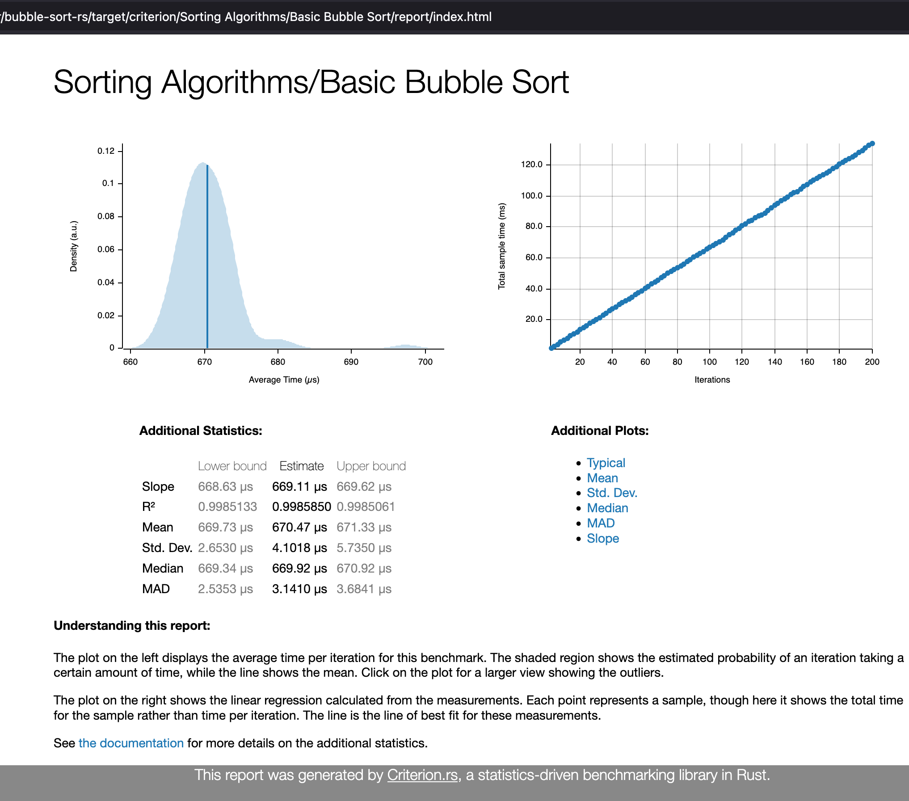
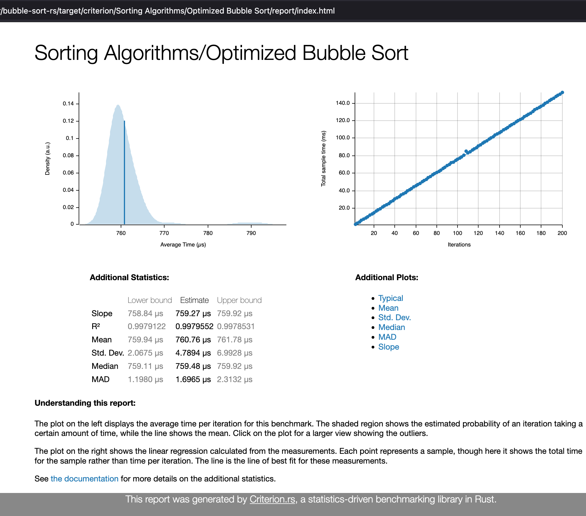
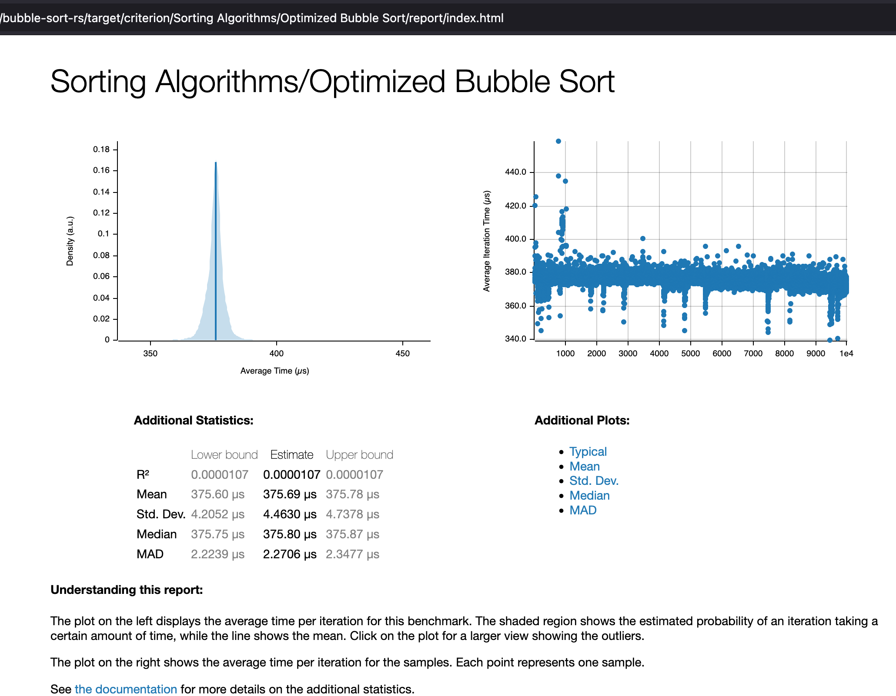
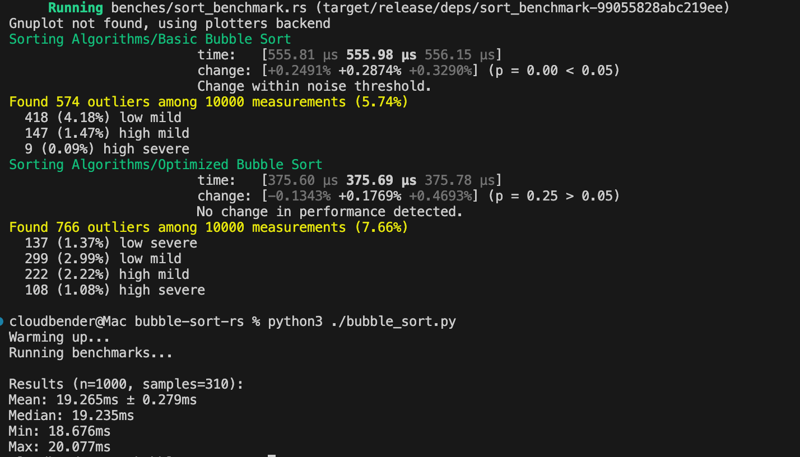

# Benchmarks

## Background
The criterion crate provides benchmarking tools to compare performance of the different implementations.

The benchmark was set up with 10,000 iterations, using a dataset of 1000 random integers. For consistency, the data set is copied to compare the performance differences between implementations.

The benchmark can be rerun using `cargo bench`

The benchmark report is located in `target/criterion/index.html`

For convenience a few screenshots are included in this writeup.

## Basic Sort



## Initial Optimized Sort
This implementation features the bubble sort with the swapped flag and early exit for an already sorted list.


## Final Optimized Sort
This implementation features the bubble sort without the swapped flag, but still includes early exit for an already sorted list. This partial optimization approach gives better runtime performance for random data sets.


## Cross Language Benchmark Results
Included is a comparison of the final optimized algorithm 
in both Rust and Python. The Python implementation is included in `bubble_sort.py`.

```
Python bubble sort (n=1000): ~19000µs
Rust bubble sort (n=1000): ~375µs
```

